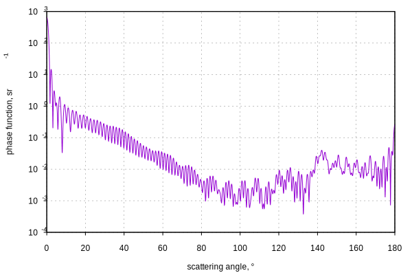

# Single and multiple scattering {#single-multiple-scattering}

## <a name="scattering-order">Scattering order</a>

When light propagates through a medium, it is scattered by the inhomogeneities of this medium (so called scattering centers). An incident wave, while scattering by the scattering centers, produces secondary waves, which also scatter, producing tertiary waves, etc. The number of scattering events that produced a given partial wave is called order of scattering: zeroth order is the incident wave, first order contains all the secondary waves (because there has been one scattering event), second order is tertiary waves (two scattering events), and so on.

## <a name="phase-function">Phase function</a>

Scattering by a single scattering center results in an outgoing wave with distribution of intensities over scattering angles depending on the size, shape, and refractive index of the scattering center. The distribution of relative intensities is called _phase function_.

As an example, a phase function of scattering of unpolarized light with wavelength of \f$500\,\mathrm{nm}\f$ by a \f$10\,\mathrm{\mu m}\f$ water drop looks as follows:

<!--
Generation of the data file:
```python
#!/usr/bin/env python3

import numpy as np
import miepython

wavelen=500
m = 1.3350+1e-9j
theta = np.linspace(0,180,10000)
mu = np.cos(theta*np.pi/180)
radius=10e3
x = 2*np.pi*radius/wavelen

mscat = miepython.i_unpolarized(m,x,mu)
np.savetxt("/tmp/phase-function-500nm-10um-water.csv", np.transpose([theta, mscat]), delimiter=',')
```

Plotting:
```sh
gnuplot -p -e "
set xlabel 'scattering angle, °';
set ylabel 'phase function, sr^{-1}';
set term svg size 600 400;
set output '/tmp/phase-function-500nm-10um-water.svg';
set grid xtics ytics;
set xtics nomirror;
set ytics nomirror;
unset mytics;
set tics scale 0.5;
set tics out;
set log y; set format y '10^{%L}';
set datafile separator ',';
plot '/tmp/phase-function-500nm-10um-water.csv' with lines notitle"
```
-->



In many cases it's possible to describe propagation of light in terms of rays, which simplifies computations. In this case we use the phase function computed from wave theory as an input, to calculate distribution of secondary, tertiary etc. rays.
